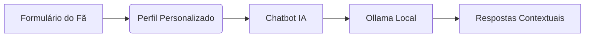

# 🚀 FURIApp Connect - Plataforma de Conexão Inteligente para Fãs da FURIA

**Aplicação web que conecta fãs da FURIA através de perfis personalizados e chatbot com IA local**, desenvolvida como solução técnica para o processo seletivo da FURIA Tech.

[]((https://furiapp-connect.vercel.app/))
[]()

## ✨ Destaques Técnicos
- **Chatbot com LLM local** via Ollama (sem dependência de APIs externas)
- **Geração de perfis personalizados** baseada em preferências do usuário
- **Sistema de match** entre fãs com perfis compatíveis
- **Arquitetura modular** com TypeScript e Tailwind CSS

## 🧠 IA Contextualizada (Ollama Integration)

- **Modelos suportados:** Mistral, Llama2, ou outros via Ollama
- **Contexto dinâmico:** Utiliza dados do perfil para personalizar respostas
- **Privacidade:** Processamento 100% local

## 🛠️ Tech Stack
| Camada          | Tecnologias                                                                 |
|-----------------|-----------------------------------------------------------------------------|
| **Frontend**    | Next.js, React, TypeScript, Tailwind CSS, Shadcn/ui                         |
| **IA**          | Ollama (mistral, llama2), LangChain (opcional)                              |
| **Hospedagem**  | Vercel                                                                      |
| **Ferramentas** | VS Code, Git, Ollama CLI                                                    |

## ⚙️ Como Executar Localmente

### Pré-requisitos
- Node.js >= 18.x
- [Ollama instalado](https://ollama.com/download)

```bash
# 1. Clone o repositório
git clone https://github.com/nathartigas/FURIApp_Connect.git

# 2. Instale dependências
npm install

# 3. Inicie o modelo de IA (terminal separado)
ollama run mistral  # ou seu modelo preferido

# 4. Execute a aplicação
npm run dev
```
Acesse: http://localhost:3000

## 📂 Estrutura de Código
```bash
src/
├── app/           # Rotas da aplicação
├── components/    # Componentes reutilizáveis
│   ├── ui/        # Componentes do Shadcn/ui
│   ├── chat/      # Lógica do chatbot
│   └── profile/   # Geração de perfis
├── lib/           # Utilitários e integração com Ollama
├── types/         # Tipos TypeScript
└── public/        # Assets estáticos
```

## 🎯 Funcionalidades Implementadas
| Funcionalidade       | Status | Dificuldade | Observações                     |
|----------------------|--------|-------------|---------------------------------|
| Landing Page         | ✅     | ⭐☆☆☆☆      | Design responsivo               |
| Formulário do Fã     | ✅     | ⭐⭐☆☆☆     | Validação em tempo real         |
| Geração de Perfil    | ✅     | ⭐⭐⭐☆☆     | Algoritmo de matching           |
| Chat com IA Local    | ✅     | ⭐⭐⭐⭐☆     | Integração complexa com Ollama  |
| Sistema de Match     | ✅     | ⭐⭐⭐☆☆     | Comparação de perfis           |
| Deploy na Vercel     | ✅     | ⭐⭐☆☆☆     | Configuração CI/CD              |

## 📌 Desafios Técnicos Superados
1. **Integração Ollama-Frontend:** 
   - Solução: Comunicação via fetch API com endpoint local
   - Desafio: Gerenciamento de sessões de chat

2. **Personalização de Respostas:**
   - Implementação: Injeção de contexto no prompt do LLM
   ```typescript
   const prompt = `Você é um assistente da FURIA. O usuário é fã do jogador ${userPlayer}. Responda: ${userInput}`
   ```

3. **Otimização de Performance:**
   - Técnicas: Cache de respostas, streaming de tokens

## ✍️ Autora
**Nathalia Artigas**  
[](https://www.linkedin.com/in/nathalia-calazans-artigas-741b0b277/)
[](https://github.com/nathartigas)

> Projeto desenvolvido como parte do processo seletivo para a FURIA Tech - Maio/2025
